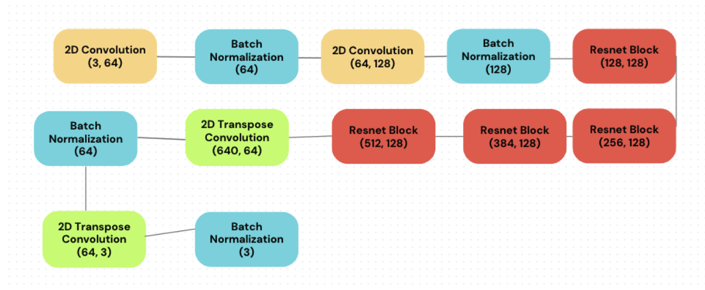
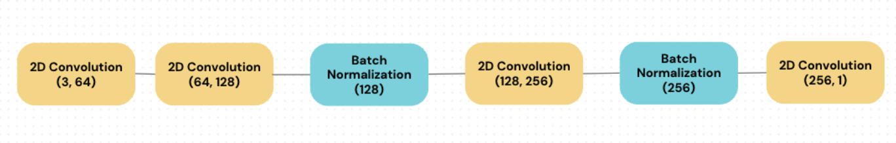
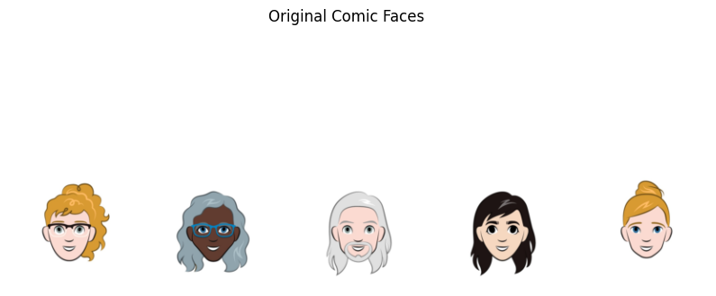
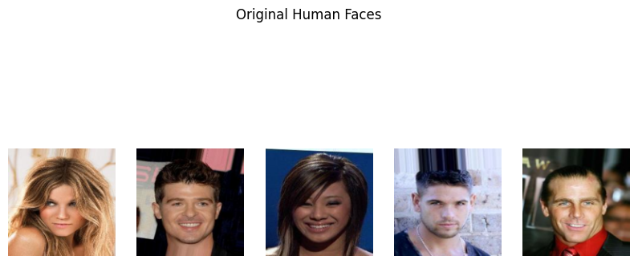
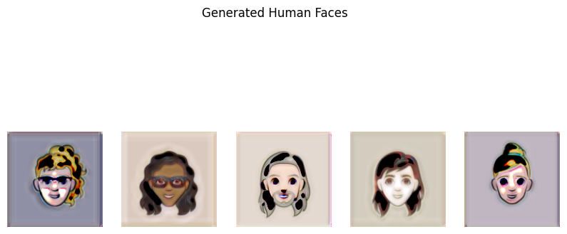
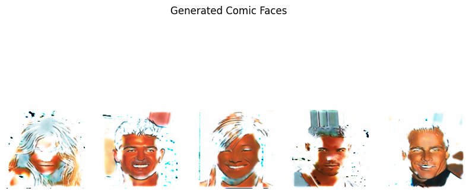

**Objective**

The goal of this project is to create a CycleGAN-based unpaired image-to-image

translation model that converts human faces to cartoon, and vice-versa. To do so, the model

utilized the Celeb A dataset for human faces available [here](https://www.kaggle.com/datasets/jessicali9530/celeba-dataset)and the Google cartoon dataset

available [here](https://www.kaggle.com/datasets/brendanartley/cartoon-faces-googles-cartoon-set/data). Since these two datasets are massive (Celeb A contains more than 200,000

images and Google cartoon contains 100,000) and I am constrained by limited computational

resources, I decided to obtain 10,000 samples from each dataset so that I could run my code

online on a Google Collab instance. This dataset reduction process is done by the second and

third cells of the generation.ipynb file. Furthermore, since these two image domains are much

more different than the Monet and landscape or zebra and horse datasets explored by the

CycleGAN paper, I did not initially expect the results to be satisfactory. However, as I will show

below, although imperfect, the results obtained were of much higher quality than I initially

envisioned. The model’s entire training process took place on a V100 GPU on Google Collab.

**Methods**

To understand the image generation process, it is first necessary to understand the

architecture of both the generators and the discriminators comprising the CycleGAN. The

generator (Generator class in utils.py) consists of the architecture below:

In the notation above, the parenthesis indicate the input and output channel values passed in

while creating each component. Specific parameters for each block (such as stride and kernel

sizes) can be viewed in the utils.py file. Furthermore, ReLU activation functions were used after

every batch normalization, and tanh function was used in the final layer. Additionally, the

“ResnetBlock” mentioned above (ResnetBlock in utils.py) is comprised of one 2D convolution

layer (with the number of input and output channels specified by the values passed in when
calling this module) followed by batch normalization, a ReLU activation function, then another

convolution followed by a last round of batch normalization. In the ResnetBlock forward pass,

the output computed after the second batch normalization is concatenated with the original input

provided to the ResnetBlock, increasing the size of the output of its forward pass. Now that we

understand the generator’s architecture, let us look at the discriminator:

As we can see, the final output has only one channel, which is sensible, since the

discriminator’s role is just to provide a metric value of how likely an example created by the

generator is to belong to a certain class of images. This contrasts with the generator’s output,

which has three channels because it is creating an RGB image. Furthermore, this type of

discriminator is called a patchGAN because it runs convolutions on segments of the image and

then combines the result for each patch to create a single, final result in the end. Our

discriminator also uses leaky ReLU activations. Now that we have discussed the architecture of

the generator and discriminator, we can describe the entire model and its training process.

The CycleGAN model proposed here utilizes two generators, one creating human-like

faces from cartoon inputs and the other generating cartoon-like images from human faces.

Furthermore, we utilize one discriminator (to determine whether an image belongs to the comic

faces class or the human faces class, to match the domain produced by the first generator). Each

model takes in two images as input (one of a human face and another of a cartoon) and performs

the following operations during the forward pass:

● Generates a comic image from the first input (which is initially a human image)

● Runs this output on the discriminator for comic images

● Generates a human face from the generated comic image in order to achieve cycle

consistency

The same process is applied to the second image, but without the second step and using the

second generator (comic to human) in the first step, as well as the comic generator in the third

step. We also run the second image through the first generator and include that in the output.

Since each CycleGAN model uses only one discriminator, we use two of such models, but for

the second model, instead of having the first generator be of comic images, it is of human

images, and the corresponding discriminator is of human faces. To see how this was

implemented in code, check the Joint\_Model class in utils.py. Now that we have understood how

the model works, we can discuss its training.

Before training the model, we create the data loader, which crops human and cartoon

faces to a 140 x 140 image patch located at the very center of each image. Then, the CycleGAN

model is trained using a combination of adversarial and cycle consistency loss functions. The

training process involves four main components: two generators (generating images in each

direction), two discriminators (distinguishing between real and fake images in each domain), and

two joint modules (enforcing cycle consistency between generators). Firstly, image pairs from

both domains (human and comic) are sampled from the dataset. The generators are then tasked

with producing fake images of the opposite domain as the real images sampled from the dataset.

The generated images are passed through the corresponding discriminator to assess their

authenticity, and the resulting losses are calculated using binary cross-entropy loss. Secondly, to

enforce cycle consistency, each generator is paired with a joint module. These joint modules take

real images from both domains and ensure that they are reconstructed faithfully when cycled

through both generators. The losses incurred during this process are computed using the L1 loss

function, measuring the pixel-wise difference between the original and reconstructed images.

During training, the parameters of all components (generators, discriminators, and joint

modules) are updated using the Adam optimizer with a learning rate of 0.0002 and betas of (0.5,

0\.999). Additionally, image pools are utilized to improve training stability and prevent model

collapse by maintaining a collection of 30 previously generated images, similarly to the original

paper. The loss for each component is calculated and used to update the corresponding

parameters through backpropagation, and the loss for each joint module is computed as

discriminator loss + 5 \* (sum of generator losses) + 10 \* cycle consistency loss. The training

process iterates over multiple epochs, where for each epoch, a single image batch (batch size of

\1) is processed through the network\. After each batch iteration, the losses incurred by the

discriminators, generators, and joint modules are printed for monitoring purposes. Finally, the

trained models' parameters are saved at the end of each epoch for later evaluation or inference.

The model was trained for 28 epochs. To see the training progress and intermediary outputs,

check out generation.ipynb.

**Results**

I have provided sample outputs generated by the model below. To see more examples, open

generation.ipynb. As we can see from the images below, the results look reasonable, with the

model learning that the human face is the relevant portion of the image and applying a pastel,

orange-like color to it that resembles that of the cartoons. It also learned to remove features that

do not appear in cartoons, such as necks, backgrounds, and hats. However, it still is not perfect

because of the white spots over some of the generated faces, which could be removed by

conducting further training and making some model design changes. Similarly, the cartoon to

human outputs also look good, with the appearance of wrinkles and the alteration to darker hair

colors (as opposed to bright orange) that resembles the appearance of most humans. These

outputs still suffer from dark spots, but they are close enough to what is expected of a

human-like cartoon to be useful.

**(Appendix)**

Comparison to paper:

The major source consulted during this project was the original unpaired image-to-image

CycleGAN implementation, [described](https://arxiv.org/abs/1703.10593)[by](https://arxiv.org/abs/1703.10593)[this](https://arxiv.org/abs/1703.10593)[paper](https://arxiv.org/abs/1703.10593). However, instead of implementing the same

model as the one described on the paper, I made various changes, including the following:

● Implemented batch normalization instead of instance normalization to test how a distinct

and more commonly used normalization method would perform

● Utilized 4 residual blocks in the generator (instead of 6 or 9, as suggested by the original

paper) due to computational constraints

● Utilized two convolutions along with two transpose convolutions in the generator instead

of 3 convolutions followed by two transpose convolutions, followed by a final

convolution (as indicated in the paper). I did this due to limited computational resources.

● The original paper uses a mean squared error (MSE) loss for the discriminator. I chose to

adopt binary cross-entropy loss instead, since it is commonly used for binary

classification.

● The original implementation stores 50 images in a pool used to create fake images. I used

30 instead to reduce memory usage.

